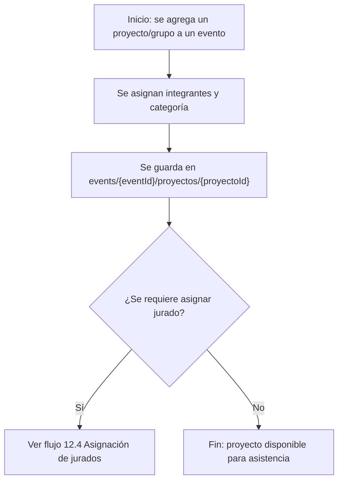
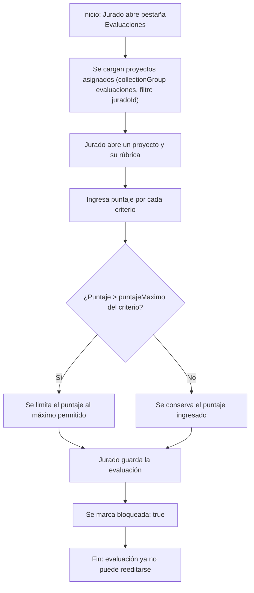
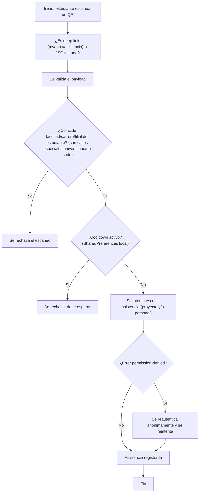
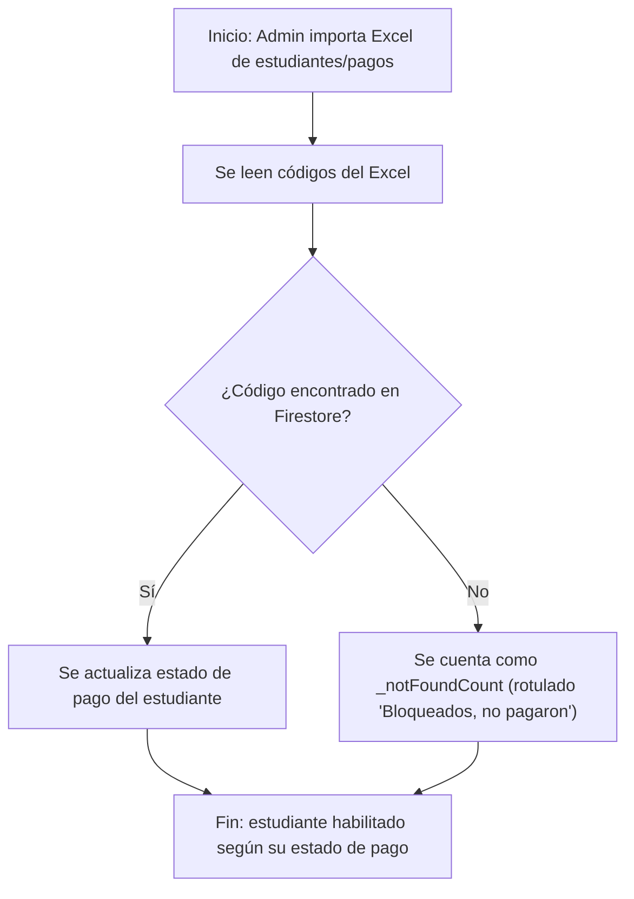
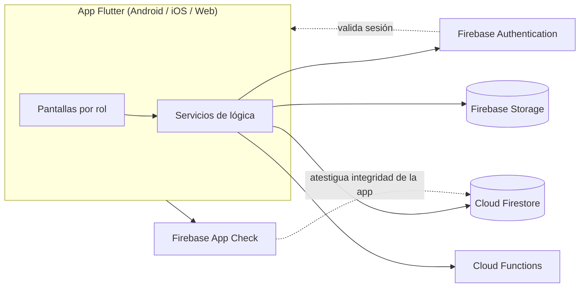
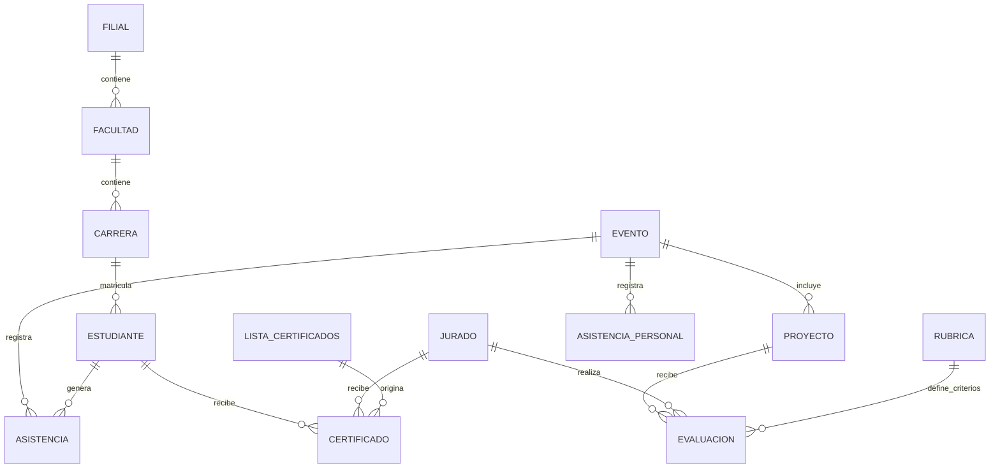

# DOCUMENTACIÓN DEL SISTEMA EVENTSCI

### Sistema de Gestión de Eventos Académicos y Científicos

---

## 1. Portada

| Campo | Valor |
|---|---|
| Universidad | Universidad Peruana Unión (UPeU) |
| Facultad |  |
| Carrera |  |
| Autor(es) |  |
| Responsable del proyecto |  |
| Versión del sistema (app) | 1.0.0+44 (según `pubspec.yaml`) |
| Versión del documento | 1.0 |
| Fecha | 2026-08-10 |

---

## 2. Control del documento

| Versión | Fecha | Descripción del cambio | Responsable |
|---|---|---|---|
| 1.0 | 2026-08-10 | Primera versión de la documentación técnica de EventSCI. |  |

---

## 3. Introducción

**EventSCI** es una aplicación móvil (Android, iOS y también compilable como aplicación Web) desarrollada en Flutter, identificada con el paquete `com.eventsci.eventos`, para la gestión de **eventos académicos y científicos** de la Universidad Peruana Unión (UPeU) — por ejemplo, ferias de proyectos, concursos y jornadas de investigación.

El sistema permite administrar el ciclo completo de un evento académico:

- Registro de estudiantes y control de su estado de pago por evento.
- Toma de asistencia mediante códigos QR.
- Evaluación de proyectos por parte de jurados, usando rúbricas configurables.
- Cálculo de una nota final que combina asistencia, evaluación de jurado y nota de docente.
- Generación de certificados en PDF para asistentes, ponentes, jurados y organizadores.
- Generación de reportes en Excel y de un informe institucional en Word.

Lo utilizan cuatro tipos de usuario (roles): **SuperAdmin/Admin**, **Admin de Carrera**, **Jurado** y **Estudiante**, cada uno con su propia pantalla principal y sus propios permisos. El backend del sistema es **Firebase** (Firestore como base de datos, autenticación, almacenamiento de archivos y funciones en la nube).

---

## 4. Antecedentes

No hay información disponible sobre el origen del proyecto, versiones anteriores o la motivación académica que dio lugar a EventSCI.

---

## 5. Problemática

A partir de las funcionalidades implementadas, estos son los problemas que el sistema resuelve:

### Problemas de gestión

Gestión dispersa de eventos, filiales, facultades, carreras y periodos académicos sin una herramienta centralizada que relacione esta información con estudiantes, proyectos y jurados.

### Problemas de asistencia

Necesidad de registrar la asistencia de estudiantes a eventos y a proyectos específicos de forma rápida y verificable, evitando el registro manual en papel o listas de Excel sueltas. El sistema resuelve esto mediante escaneo de códigos QR (ver sección 12.6).

### Problemas de evaluación

Necesidad de que múltiples jurados evalúen proyectos de forma estandarizada (contra una rúbrica con criterios y puntajes máximos) y de combinar esa evaluación con otras notas (asistencia, docente) en una nota final única.

### Problemas de certificados

Necesidad de emitir certificados en PDF para distintos roles (asistente, ponente, jurado, organizador) con firmas institucionales configurables, evitando el diseño y llenado manual de cada certificado.

### Problemas de reportes

Necesidad de consolidar información de certificados y notas finales en reportes descargables (Excel) e informes institucionales (Word), en vez de recopilar la información manualmente desde múltiples fuentes.

### Problemas relacionados con pagos

Existe un módulo de control de pagos e importación de estudiantes/pagos desde Excel (ver sección 11.3). La interfaz de importación de pagos muestra "Bloqueados (no pagaron)", pero ese contador en realidad mide códigos del Excel no encontrados en Firestore, y el código no marca explícitamente el estado `bloqueadoPorPago: true` en esos casos (ver DT-017) — hay puntos de inconsistencia sin resolver en la verificación de pagos. No existe integración con un sistema financiero institucional externo.

---

## 6. Justificación

EventSCI aporta los siguientes beneficios:

- **Centralización de información**: eventos, estudiantes, proyectos, jurados, rúbricas, asistencia, evaluaciones y certificados se gestionan en una base de datos común (Firestore), organizada por filial, facultad y carrera.
- **Automatización de procesos**: generación de certificados PDF, cálculo de nota final y generación de reportes Excel/Word de forma programática en lugar de manual.
- **Reducción de trabajo manual**: registro de asistencia por QR en lugar de listas físicas; importación masiva de estudiantes/pagos/notas de docente desde Excel.
- **Control de asistencia**: asistencia por proyecto y "asistencia personal" con ventana horaria configurable, con un registro individual (`scans`/`registros`) por cada escaneo.
- **Evaluación estandarizada**: rúbricas con secciones y criterios reutilizables entre distintos roles administrativos.
- **Gestión de participantes y ganadores**: módulos dedicados para consolidar participantes y determinar ganadores por evento.
- **Mejora de la administración por rol**: cada nivel administrativo (SuperAdmin, Admin de filial, Admin de Carrera) tiene su propio alcance de gestión, evitando que un admin de carrera dependa de un superadministrador para tareas cotidianas.

---

## 7. Objetivos

### 7.1 Objetivo general

Proveer a la Universidad Peruana Unión (UPeU) de un sistema móvil centralizado que permita administrar el ciclo completo de eventos académicos y científicos —registro de participantes, control de pagos, asistencia por QR, evaluación por jurados, cálculo de notas finales, emisión de certificados y generación de reportes— con acceso diferenciado por rol.

### 7.2 Objetivos específicos

- Permitir el registro y administración de estudiantes, sus pagos y su asistencia a eventos.
- Permitir la creación y administración de eventos, proyectos/grupos y jurados.
- Permitir la evaluación de proyectos mediante rúbricas configurables por sección y criterio.
- Calcular una nota final combinando asistencia, evaluación de jurado y nota de docente.
- Emitir certificados en PDF para los distintos roles participantes de un evento.
- Generar reportes en Excel y un informe institucional en Word por evento.
- Diferenciar el acceso y las capacidades del sistema según el rol del usuario (SuperAdmin/Admin, Admin de Carrera, Jurado, Estudiante).
- Administrar de forma jerárquica la estructura institucional (filiales, facultades, carreras, periodos académicos).

---

## 8. Alcance del sistema

### 8.1 Funcionalidades dentro del alcance

(Ver sección 11 para el detalle completo por módulo.)

- Gestión de eventos, periodos y sesiones.
- Registro de estudiantes y control de pagos.
- Gestión de proyectos/grupos y su asignación a jurados.
- Gestión de jurados y de rúbricas de evaluación.
- Control de asistencia por QR de proyecto y asistencia personal con ventana horaria.
- Sellos de asistencia con meta configurable.
- Evaluación de proyectos por jurado y cálculo de nota final.
- Generación de certificados en PDF (asistente, ponente, jurado, organizador) con firmas configurables.
- Reportes en Excel y un informe institucional en Word.
- Gestión de filiales, facultades y carreras.
- Gestión de cuentas de Admin de Carrera.
- Rol delegado "Asistente QR" para estudiantes.
- Bloqueo de dispositivos y control de sesión (seguridad).

### 8.2 Fuera del alcance

- Integración con un sistema financiero institucional externo para verificación automática de pagos (ver propuesta en sección 24).
- Soporte multi-idioma: el locale está fijo a `es_ES`.
- Cualquier otro proceso institucional no cubierto por la app (p. ej. matrícula, pagos de pensión, gestión curricular).

### 8.3 Mejoras futuras

Ver sección 24 para la propuesta de integración con el sistema financiero institucional. Las demás mejoras futuras están registradas como deuda técnica en las secciones 22 y 23; no son funcionalidades planificadas formalmente, sino puntos que requieren decisión del equipo de desarrollo.

---

## 9. Descripción general del sistema

### En términos simples

EventSCI es una aplicación de celular. Cada tipo de usuario (administrador, jurado o estudiante) inicia sesión y ve una pantalla distinta con las opciones que le corresponden. Toda la información (eventos, estudiantes, notas, certificados) se guarda en internet, en un servicio de Google llamado Firebase, así que no depende de un solo teléfono ni de un servidor propio de la universidad.

### Detalle técnico

| Aspecto | Descripción |
|---|---|
| Plataforma | Flutter (Android, iOS; también compilable a Web). SDK Dart requerido: `^3.8.1`. |
| Backend | Firebase: Firestore (base de datos), Firebase Authentication, Firebase Storage, Cloud Functions, Firebase App Check. |
| Autenticación | Anónima (Firebase Auth) para todos los roles salvo SuperAdmin, que usa email + OTP. Las contraseñas reales no se validan contra Firebase Auth, sino comparando un valor cifrado (AES-CBC) guardado en Firestore. |
| Almacenamiento de archivos | Firebase Storage (p. ej. firmas para certificados, vía `firma_storage_helper.dart`). |
| Sesión local | `PrefsHelper`, sobre `shared_preferences`, es la fuente de verdad de la sesión local (rol, datos de usuario, validez de sesión). |
| Seguridad de plataforma | Firebase App Check activo en builds de release (Play Integrity en Android, DeviceCheck en iOS); en modo debug se usan providers de debug. |
| Locale | Fijo a `es_ES` (paquete `intl`). No hay soporte multi-idioma. |
| Generación de documentos | Excel vía paquete `excel`; PDF vía `pdf` + `printing`; informes Word manipulando un `.docx` como XML/ZIP crudo (paquetes `xml` + `archive`) a partir de una plantilla (`assets/plantilla_informe.docx`). |
| Compartir/abrir archivos | `share_plus` y `open_filex`. |

### Flujo general

1. El usuario abre la app; `AuthWrapper` (en `main.dart`) lee el rol guardado en `PrefsHelper`.
2. Según el rol, se muestra una de las cuatro pantallas principales: `AdminScreen`, `AdminCarreraScreen`, `JuradosScreen` o `EstudianteScreen`.
3. Cada pantalla llama a servicios (`logica/`) que leen y escriben datos en Firestore/Storage.
4. Las acciones sensibles (cambios de asistencia, evaluación, generación de certificados) quedan registradas como documentos en las colecciones correspondientes de Firestore.

---

## 10. Usuarios y roles

El sistema define **cinco constantes de rol** en `PrefsHelper`, que se agrupan en **cuatro pantallas principales**:

| Rol (constante) | Quién lo usa | Pantalla principal | Autenticación | Particularidad |
|---|---|---|---|---|
| `superAdmin` | Administrador de toda la plataforma | `AdminScreen` | Firebase Auth con email + OTP | Acceso completo a todas las filiales. |
| `admin` | Administrador de una filial | `AdminScreen` (misma pantalla que SuperAdmin) | Sesión anónima de Firebase Auth | Acceso acotado a su filial. |
| `admin_carrera` | Administrador de una carrera específica | `AdminCarreraScreen` | Sesión anónima de Firebase Auth | Acceso controlado por una lista de `permisos`; cada módulo (tile) del dashboard verifica `_tienePermiso()` antes de mostrarse. |
| `jurado` | Miembro de jurado | `JuradosScreen` | Sesión anónima de Firebase Auth | Dos pestañas: Evaluaciones y Certificados. |
| `student` | Estudiante | `EstudianteScreen` | Sesión anónima de Firebase Auth | Puede además ser delegado como "Asistente QR" (flag `esAsisteQR`) para tomar asistencia de otros estudiantes. |

### Restricciones y controles adicionales por rol

- **Admin de Carrera**: la lista `permisos` determina qué módulos ve. Advertencia (ver DT-013): `admin_carrera_service.dart` sobrescribe esta lista con un conjunto fijo (hardcodeado) en cada inicio de sesión, lo que anula cualquier personalización granular de permisos.
- **Estudiante**: sujeto a verificaciones adicionales al iniciar sesión: estado de pago, bloqueo de dispositivo, bloqueo de sesión y cuenta deshabilitada (`PrefsHelper`).
- **Todos los roles no-SuperAdmin**: la validez de la sesión puede ser invalidada del lado del servidor cuando un administrador cambia la contraseña de un usuario (`isSessionValid()` verifica un token en Firestore); `ensureAuthActiva()` restaura la sesión anónima si el sistema operativo la cerró.

---

## 11. Módulos del sistema

### 11.1 Gestión de eventos

- **Objetivo**: crear y administrar los eventos académicos (nombre, periodo, filial/facultad/carrera asociada).
- **Usuarios**: SuperAdmin/Admin, Admin de Carrera.
- **Funcionalidades**: crear evento, listar eventos, ver detalle de evento.
- **Flujo**: ver sección 12.2.
- **Datos involucrados**: colección `events/{eventId}`.
- **Dependencias**: `eventos_service.dart` y `periodos_helper.dart` (compartidos entre Admin y Admin de Carrera); en Admin de Carrera, la pantalla de creación de eventos (`crear_eventos_carrera_screen.dart`) construye su propio `StreamBuilder` sobre `events` en vez de reutilizar `EventosFiltradosService` (ver DT-010).

### 11.2 Gestión de estudiantes

- **Objetivo**: registrar y administrar estudiantes por carrera/filial.
- **Usuarios**: SuperAdmin/Admin, Admin de Carrera.
- **Funcionalidades**: registro de estudiantes, listado de estudiantes registrados, edición de datos.
- **Flujo**: ver sección 12.1.
- **Datos involucrados**: `users/{carreraPath}/students/{studentId}`, índice `student_index/{username}/entries/{id}` para login.
- **Dependencias**: `PrefsHelper` (CRUD de estudiante); `resolver_nombres_service.dart` (resolución de nombres de estudiantes a partir de códigos/IDs).

### 11.3 Gestión de pagos

- **Objetivo**: registrar y verificar el estado de pago de los estudiantes por evento.
- **Usuarios**: SuperAdmin/Admin.
- **Funcionalidades**: control de pagos, importación masiva de estudiantes/pagos desde Excel.
- **Flujo**: ver sección 12.10.
- **Datos involucrados**: estado de pago del estudiante (campo `bloqueadoPorPago` u homólogo, dentro del registro del estudiante).
- **Dependencias**: `control_pagos_screen`, `importacion_selector_screen`, `importacion_estudiantes_pagos_screen` (clase `ImportacionPagosScreen`).
- **Problema conocido**: el rótulo "Bloqueados (no pagaron)" mostrado al usuario no coincide con lo que el contador realmente mide (códigos de Excel no encontrados en Firestore); el sistema no marca explícitamente `bloqueadoPorPago: true` en esos casos (DT-017).

### 11.4 Gestión de proyectos y grupos

- **Objetivo**: administrar los proyectos/grupos inscritos a un evento y asignarlos a categorías.
- **Usuarios**: SuperAdmin/Admin, Admin de Carrera.
- **Funcionalidades**: agregar proyecto, asignar proyectos, gestión de grupos, categorías de proyecto.
- **Flujo**: ver sección 12.3.
- **Datos involucrados**: `events/{eventId}/proyectos/{proyectoId}`.
- **Dependencias**: `grupos_service.dart`, `agregar_proyecto_service.dart`, `asignar_proyectos_service.dart` (compartidos entre Admin y Admin de Carrera). `grupos_service.dart.resolverNombresPorCodigos()` cae, como fallback, a escanear toda la colección `users` cuando la búsqueda directa no encuentra resultados — consulta potencialmente costosa a escala (DT-018).

### 11.5 Gestión de jurados

- **Objetivo**: crear, editar y administrar cuentas de jurado.
- **Usuarios**: SuperAdmin/Admin (crea/edita jurados), Admin de Carrera (gestiona jurados de su carrera).
- **Funcionalidades**: crear jurado, editar jurado, gestión de jurados a nivel SuperAdmin.
- **Flujo**: ver sección 12.4.
- **Datos involucrados**: cuentas de jurado dentro de `users` (top-level, `userType == 'jurado'`).
- **Dependencias**: `jurados_service.dart` (compartido entre Admin y Admin de Carrera).
- **Nota de seguridad**: las pantallas de gestión de jurados descifran y muestran la contraseña/DNI actual en texto plano (con botón de copiar) al editar, usando el modelo de cifrado reversible descrito en la sección 18.

### 11.6 Gestión de rúbricas y criterios de evaluación

- **Objetivo**: definir las rúbricas (secciones y criterios con puntaje máximo) contra las cuales se evalúan los proyectos.
- **Usuarios**: SuperAdmin/Admin, Admin de Carrera, Jurado (consulta/uso).
- **Funcionalidades**: crear rúbrica, editar rúbrica, gestión de rúbricas.
- **Datos involucrados**: colección `rubricas/{id}` (secciones + criterios + jurados asignados).
- **Dependencias**: `gestion_criterios.dart` (modelo `Rubrica`/`SeccionRubrica`/`Criterio` + `RubricasService`), `rubrica_validation.dart` — código compartido entre los tres roles administrativos y de jurado.

### 11.7 Control de asistencia (QR de proyecto)

- **Objetivo**: registrar la asistencia de estudiantes a proyectos mediante escaneo de código QR.
- **Usuarios**: Estudiante (escanea), SuperAdmin/Admin y Admin de Carrera (supervisan/consultan).
- **Funcionalidades**: escaneo de QR, registro de asistencia por proyecto, historial de asistencia.
- **Flujo**: ver sección 12.6.
- **Datos involucrados**: `events/{eventId}/asistencias/{studentId}` y su subcolección `scans/{scanId}`; `qr_codes/{qrId}`; `codigos/{codigo}` (código manual de 6 dígitos).
- **Dependencias**: `escanear_qr_service.dart` (motor central del rol Estudiante); `control_asistencias_screen.dart` (pantalla más grande del proyecto, 3078 líneas, lado Admin); `escaner_config_service.dart` (cooldown global, compartido Admin/Estudiante).

### 11.8 Asistencia personal (QR con ventana horaria)

- **Objetivo**: registrar asistencia general al evento (no a un proyecto puntual) mediante un QR válido solo dentro de una ventana horaria configurable.
- **Usuarios**: Admin de Carrera (configura), Estudiante (escanea).
- **Funcionalidades**: configuración de ventana horaria, cálculo en vivo del estado (`activo`/`expirado`/`fuera_ventana`).
- **Datos involucrados**: `events/{eventId}/asistencias_personales/{asistId}` y subcolección `registros/{studentId}`.
- **Dependencias**: `asistencias_personales_screen.dart`, `configuracion_asistencias_personales.dart`, clase `AsistenciaPersonalConfig` — exclusivo de Admin de Carrera.

### 11.9 Sellos de asistencia

- **Objetivo**: convertir una meta de "sellos" de asistencia acumulados en una nota de 0 a 20.
- **Usuarios**: Admin de Carrera.
- **Funcionalidades**: configuración de meta de sellos, cálculo de nota por sellos.
- **Datos involucrados**: colección `sellos_asistencia/{compositeId}` (compuesto por filial/facultad/carrera/evento).
- **Dependencias**: `configurar_sellos.dart`, `notas_por_sellos_screen.dart`.
- **Problema conocido**: sanitización inconsistente del ID compuesto entre `configurar_sellos_service.dart` (limpia espacios, `/` y `.`) y `notas_por_sellos_service.dart`/`evaluacion_final_carrera_service.dart` (solo limpian espacios) — puede generar IDs distintos para lo que debería ser el mismo documento si el nombre de filial/facultad/carrera contiene `/` o `.` (DT-002).

### 11.10 Evaluaciones (Jurado)

- **Objetivo**: permitir que un jurado califique los proyectos que le fueron asignados, por criterio de la rúbrica correspondiente.
- **Usuarios**: Jurado.
- **Funcionalidades**: listar proyectos asignados (agrupados por rúbrica), calificar por criterio con límite (`clamp`) al puntaje máximo, bloqueo de la evaluación (`bloqueada: true`) al guardar para impedir reediciones.
- **Flujo**: ver sección 12.5.
- **Datos involucrados**: `events/{eventId}/proyectos/{proyectoId}/evaluaciones/{juradoId}` (consultado también vía `collectionGroup('evaluaciones')` filtrado por `juradoId`).
- **Dependencias**: `jurado_proyectos_service.dart`, `evaluacion_proyecto_screen.dart`, `evaluacion_service.dart`.
- **Bug potencial**: cuando una evaluación no tiene `rubricaId` reconocible, el código localiza una rúbrica candidata pero la descarta y usa la primera rúbrica del mapa como respaldo; si un jurado está asignado a más de una rúbrica, esto puede atribuir el proyecto a la rúbrica equivocada (DT-011).

### 11.11 Cálculo de nota final

- **Objetivo**: calcular la nota final de un participante combinando asistencia, evaluación de jurado y nota de docente.
- **Usuarios**: SuperAdmin/Admin, Admin de Carrera.
- **Funcionalidades**: configuración de pesos, cálculo de nota final, importación de notas de docente.
- **Flujo**: ver sección 12.7.
- **Datos involucrados**: `evaluacion_final_config/{docId}` (pesos configurables); `events/{eventId}/notas_docente/{codigo}` (lado Admin) y `events/{eventId}/notasDocentes/{codigo}` (lado Admin de Carrera).
- **Dependencias**: modelos compartidos `EvalFinalConfig`, `NotaFinalItem`, `IntegranteRef`; cálculo puro y testeable en `evaluacion_final_calculo.dart` (Admin de Carrera).
- **Fragmentación de datos**: `notas_docente` (snake_case, lado Admin) y `notasDocentes` (camelCase, lado Admin de Carrera) son colecciones distintas de facto — una nota importada por un flujo puede no ser vista por el otro (DT-001).
- **Duplicación de fórmula**: `evaluacion_final_super_admin_screen.dart` (Admin) reimplementa el mismo cálculo que `evaluacion_final_calculo.dart` (Admin de Carrera); el propio código deja un comentario advirtiendo que ambos deben mantenerse sincronizados manualmente (DT-020).

### 11.12 Certificados

- **Objetivo**: generar certificados en PDF para asistentes, ponentes, jurados y organizadores, con firmas institucionales configurables.
- **Usuarios**: SuperAdmin/Admin (configura firmas y listas), Jurado y Estudiante (descargan su certificado).
- **Funcionalidades**: configuración de firmas (vicerrector, director de investigación, decanos por facultad), creación de listas de certificados, importación de códigos de certificado, generación de PDF.
- **Flujo**: ver sección 12.8.
- **Datos involucrados**: `listas_certificados/{id}`; certificados emitidos bajo `users/{...}/certificados/{certId}` (tanto para estudiantes como para jurados); `config_firmas/vicerrector`, `config_firmas/director_investigacion`, `config_firmas/decanos/facultades/{facultadId}`.
- **Dependencias**: `certificado_builder.dart` (único archivo verdaderamente compartido entre los 4 roles), `certificado_texto_helper.dart`, `firma_storage_helper.dart`.
- **Duplicación de código**: la descarga de firma + generación de PDF está casi duplicada entre `jurado_certificados_service.dart` (Jurado) y `ver_certificados_controller.dart` (Estudiante) (DT-005); los modelos `CertItem` (Jurados) y `CertificadoItem` (Usuarios) son casi idénticos salvo el nombre de una propiedad (DT-006); la lógica de "buscar lista existente y hacer merge" está repetida en tres pantallas distintas (DT-004).

### 11.13 Reportes

- **Objetivo**: generar reportes consolidados de certificados y de nota final en Excel, y un informe institucional en Word.
- **Usuarios**: SuperAdmin/Admin (reportes generales), Admin de Carrera (informe institucional).
- **Funcionalidades**: reporte de usuarios (orquesta los demás), reporte de certificados (Excel), reporte final (Excel), informe institucional en Word.
- **Flujo**: ver sección 12.9.
- **Datos involucrados**: certificados, notas finales, datos de evento — recolectados desde las colecciones ya descritas.
- **Dependencias**: `reporte_usuarios_service.dart`, `reporte_certificados_service.dart`, `reporte_final_service.dart` y sus contrapartes Excel; `informe_word_data_service.dart` + `informe_word_docx_builder.dart` (clase `InformeWordGenerator`) sobre la plantilla `assets/plantilla_informe.docx`.
- **Duplicación de código**: el matcher difuso (Levenshtein + normalización fonética) está reimplementado de forma independiente en `reporte_certificados_service.dart` y en `agregar_jurados_bloque_screen.dart` (DT-003).

### 11.14 Gestión de filiales, facultades y carreras

- **Objetivo**: administrar la jerarquía institucional (sede → facultad → carrera).
- **Usuarios**: SuperAdmin/Admin.
- **Funcionalidades**: crear filiales.
- **Datos involucrados**: `filiales/{filialId}/facultades/{facultadId}/carreras/{carreraId}`.
- **Dependencias**: `filiales_service.dart` (compartido Admin/Admin de Carrera); `facultad_id_helper.dart` (shared, pero usado solo por Admin) debe mantenerse "byte-idéntico" a `FilialesService._generarId()` según advertencia en el propio código, sin garantía automática de sincronización (DT-019).

### 11.15 Gestión de periodos académicos

- **Objetivo**: administrar los periodos académicos asociados a eventos.
- **Usuarios**: SuperAdmin/Admin.
- **Datos involucrados**: colección `periodos/{id}`.
- **Dependencias**: `periodos_helper.dart` (compartido Admin/Admin de Carrera).

### 11.16 Gestión de sesiones (SuperAdmin)

- **Objetivo**: no se pudo determinar con precisión desde el código (existe `gestion_sesiones_super_admin_screen` y `gestion_sesiones_service.dart` compartido, pero sin un propósito funcional exacto documentado).
- **Usuarios**: SuperAdmin/Admin.
- **Dependencias**: `gestion_sesiones_service.dart` (compartido Admin/Admin de Carrera).

### 11.17 Informe institucional (Word)

- **Objetivo**: generar un informe institucional del evento en formato Word a partir de una plantilla.
- **Usuarios**: Admin de Carrera.
- **Funcionalidades**: recolección de datos del evento y generación del documento `.docx`.
- **Dependencias**: `informe_evento_carrera_screen.dart` → `informe_word_data_service.dart` → `informe_word_docx_builder.dart`, manipulando el `.docx` como XML/ZIP crudo contra `assets/plantilla_informe.docx`.

### 11.18 Gestión de cuentas de Admin de Carrera

- **Objetivo**: crear y editar cuentas de Admin de Carrera.
- **Usuarios**: SuperAdmin/Admin (según la ubicación real del enlace de navegación).
- **Funcionalidades**: crear admin de carrera, editar admin de carrera.
- **Dependencias**: `gestion_admins_carrera_screen.dart`, `dialogo_crear_admin_carrera`, `dialogo_editar_admin_carrera`.
- **Inconsistencia**: estas pantallas viven físicamente en `roles/admin_carrera/pantallas/`, pero **no** están enlazadas desde el propio `admin_carrera_screen.dart`; sí están enlazadas desde `admin_screen.dart` (rol Admin/SuperAdmin). Es funcionalmente correcto, pero la ubicación de carpeta es engañosa (DT-014).

### 11.19 Asistente QR delegado (rol de estudiante)

- **Objetivo**: permitir que un estudiante delegado ("Asistente QR") tome asistencia de otros estudiantes.
- **Usuarios**: Estudiante con flag `esAsisteQR` activo (administrado desde Admin de Carrera vía `gestion_roles_screen.dart`).
- **Funcionalidades**: escaneo de asistencia en nombre de otros, gestión por categoría de proyecto.
- **Dependencias**: `asistente_qr_screen.dart`, `proyectos_categoria_screen.dart` (define la clase `ProyectosCategoriaAsistenteScreen`), `proyectos_qr_service.dart`; depende directamente de `codigo_asistencia_service.dart` (Admin de Carrera) — única dependencia cruzada de Usuarios hacia Admin de Carrera.

### 11.20 Configuración del escáner y bloqueo de dispositivos

- **Objetivo**: configurar un cooldown (tiempo mínimo entre escaneos) para el escáner QR y bloquear dispositivos cuando corresponda.
- **Usuarios**: SuperAdmin/Admin (configura), Estudiante (aplica el cooldown al escanear).
- **Datos involucrados**: `config/escaner_bloqueo`; `blocked_devices/{deviceId}`.
- **Dependencias**: `escaner_config_service.dart` (compartido Admin/Estudiante), `control_bloqueo_escaner_screen.dart`.
- **Riesgo**: el *valor* del cooldown se configura en Firestore, pero su *aplicación* es del lado del cliente (`SharedPreferences` del dispositivo) — un usuario que borre datos de la app o cambie de dispositivo evade el cooldown (DT-007).

---

## 12. Flujos principales del sistema

### 12.1 Registro de estudiante

```mermaid
flowchart TD
    A[Inicio: Admin/Admin de Carrera abre "Registro de estudiantes"] --> B[Ingresa datos del estudiante o importa Excel]
    B --> C{¿Datos válidos y no duplicados?}
    C -- No --> B
    C -- Sí --> D[Se cifra DNI/contraseña con AES-CBC]
    D --> E["Se guarda en users/{carreraPath}/students/{studentId}"]
    E --> F["Se registra índice en student_index para login"]
    F --> G[Fin: estudiante disponible para iniciar sesión]
```

### 12.2 Gestión de eventos

```mermaid
flowchart TD
    A[Inicio: Admin/Admin de Carrera abre "Crear evento"] --> B[Completa nombre, periodo, filial/facultad/carrera]
    B --> C{¿Datos completos?}
    C -- No --> B
    C -- Sí --> D["Se crea documento en events/{eventId}"]
    D --> E[Evento visible en listado de eventos]
    E --> F[Fin]
```

### 12.3 Registro de proyecto



### 12.4 Asignación de jurados

```mermaid
flowchart TD
    A[Inicio: Admin/Admin de Carrera abre "Asignar proyectos"] --> B[Selecciona jurado y rúbrica]
    B --> C[Selecciona proyecto(s) a asignar]
    C --> D["Se crea/actualiza documento en proyectos/{id}/evaluaciones/{juradoId}"]
    D --> E[Fin: el jurado ve el proyecto en su listado de evaluaciones]
```

### 12.5 Evaluación



### 12.6 Registro de asistencia mediante QR



### 12.7 Cálculo de nota final

```mermaid
flowchart TD
    A[Inicio: Admin/Admin de Carrera abre "Evaluación final"] --> B["Se leen pesos configurables (evaluacion_final_config)"]
    B --> C[Se recopila nota de asistencia/sellos]
    C --> D[Se recopila nota de jurado]
    D --> E["Se recopila nota de docente (notas_docente o notasDocentes según el módulo)"]
    E --> F[Se calcula nota final ponderada]
    F --> G[Fin: nota final disponible para reportes y certificados]
```

> Nota: el cálculo se implementa de forma independiente en el lado Admin y en el lado Admin de Carrera; ver DT-020 en la sección 22.

### 12.8 Generación de certificados

```mermaid
flowchart TD
    A[Inicio: se crea/edita una lista de certificados] --> B[Se configuran firmas institucionales requeridas]
    B --> C{"¿Ya existe una lista similar para ese rol/filial/carrera/evento?"}
    C -- Sí --> D[Se hace merge con la lista existente]
    C -- No --> E[Se crea nueva lista]
    D --> F[Usuario final (jurado/estudiante) abre pestaña Certificados]
    E --> F
    F --> G[Se descarga la firma desde Storage]
    G --> H[Se genera el PDF con certificado_builder]
    H --> I[Fin: certificado disponible para compartir/abrir]
```

### 12.9 Generación de reportes

```mermaid
flowchart TD
    A[Inicio: Admin abre "Reporte de usuarios"] --> B{"¿Qué reporte?"}
    B -- Certificados --> C[reporte_certificados_service recopila certificados emitidos]
    B -- Nota final --> D[reporte_final_service recopila notas finales]
    B -- Informe institucional --> E["informe_word_data_service recopila datos del evento"]
    C --> F[Se exporta a Excel]
    D --> F
    E --> G["informe_word_docx_builder genera el .docx desde la plantilla"]
    F --> H[Fin: archivo listo para compartir/abrir]
    G --> H
```

### 12.10 Gestión de pagos



> Nota: el rótulo de la interfaz y lo que realmente mide el contador `_notFoundCount` no coinciden de forma exacta — ver DT-017.

---

## 13. Requisitos funcionales

| ID | Requisito | Módulo | Prioridad |
|---|---|---|---|
| RF-001 | El sistema debe permitir el registro de estudiantes, incluyendo cifrado de DNI y contraseña. | Gestión de estudiantes | Alta |
| RF-002 | El sistema debe permitir la importación masiva de estudiantes/pagos desde archivos Excel. | Gestión de pagos | Alta |
| RF-003 | El sistema debe permitir consultar el estado de pago de un estudiante. | Gestión de pagos | Alta |
| RF-004 | El sistema debe permitir crear, listar y ver el detalle de eventos. | Gestión de eventos | Alta |
| RF-005 | El sistema debe permitir crear y administrar periodos académicos. | Gestión de periodos | Media |
| RF-006 | El sistema debe permitir crear filiales, facultades y carreras. | Gestión de filiales | Media |
| RF-007 | El sistema debe permitir agregar proyectos/grupos a un evento. | Gestión de proyectos y grupos | Alta |
| RF-008 | El sistema debe permitir asignar proyectos a categorías. | Gestión de proyectos y grupos | Media |
| RF-009 | El sistema debe permitir crear y editar cuentas de jurado. | Gestión de jurados | Alta |
| RF-010 | El sistema debe permitir asignar jurados a proyectos mediante una rúbrica. | Asignación de jurados | Alta |
| RF-011 | El sistema debe permitir crear y editar rúbricas con secciones y criterios con puntaje máximo. | Gestión de rúbricas | Alta |
| RF-012 | El sistema debe permitir a un jurado calificar un proyecto asignado, criterio por criterio, sin exceder el puntaje máximo. | Evaluaciones | Alta |
| RF-013 | El sistema debe bloquear una evaluación (`bloqueada: true`) una vez guardada, impidiendo su reedición. | Evaluaciones | Alta |
| RF-014 | El sistema debe permitir el registro de asistencia de un estudiante mediante escaneo de código QR. | Control de asistencia | Alta |
| RF-015 | El sistema debe validar que el QR escaneado corresponda a la facultad/carrera/filial del estudiante (con casos especiales "universitario"/"de sede"). | Control de asistencia | Alta |
| RF-016 | El sistema debe aplicar un tiempo de espera (cooldown) entre escaneos de un mismo usuario. | Control de asistencia | Media |
| RF-017 | El sistema debe reintentar la reautenticación anónima cuando un escaneo falla por permiso denegado. | Control de asistencia | Media |
| RF-018 | El sistema debe permitir configurar una "asistencia personal" con ventana horaria y calcular su estado (activo/expirado/fuera de ventana) en vivo. | Asistencia personal | Media |
| RF-019 | El sistema debe permitir configurar una meta de "sellos" de asistencia y calcular la nota correspondiente. | Sellos de asistencia | Media |
| RF-020 | El sistema debe permitir configurar los pesos para el cálculo de la nota final. | Cálculo de nota final | Alta |
| RF-021 | El sistema debe calcular la nota final combinando asistencia, evaluación de jurado y nota de docente. | Cálculo de nota final | Alta |
| RF-022 | El sistema debe permitir importar notas de docente. | Cálculo de nota final | Media |
| RF-023 | El sistema debe permitir configurar firmas institucionales (vicerrector, director de investigación, decanos por facultad) para certificados. | Certificados | Alta |
| RF-024 | El sistema debe permitir crear listas de certificados por rol, filial, carrera y evento, evitando duplicar listas existentes (merge). | Certificados | Alta |
| RF-025 | El sistema debe generar certificados en PDF para asistente, ponente, jurado y organizador. | Certificados | Alta |
| RF-026 | El sistema debe permitir generar reportes en Excel de certificados emitidos y de notas finales. | Reportes | Alta |
| RF-027 | El sistema debe permitir generar un informe institucional en Word a partir de una plantilla. | Reportes | Media |
| RF-028 | El sistema debe permitir crear y editar cuentas de Admin de Carrera. | Gestión de cuentas Admin de Carrera | Media |
| RF-029 | El sistema debe restringir los módulos visibles a un Admin de Carrera según su lista de `permisos`. | Usuarios y roles | Alta |
| RF-030 | El sistema debe permitir delegar el rol de "Asistente QR" a un estudiante para tomar asistencia de otros. | Asistente QR delegado | Media |
| RF-031 | El sistema debe permitir bloquear dispositivos y configurar el cooldown global del escáner. | Configuración del escáner | Media |
| RF-032 | El sistema debe invalidar la sesión de un usuario cuando un administrador cambia su contraseña. | Seguridad / sesión | Alta |

---

## 14. Requisitos no funcionales

| Categoría | Descripción |
|---|---|
| Seguridad | Autenticación anónima de Firebase para roles no-SuperAdmin; autenticación email+OTP para SuperAdmin; cifrado AES-CBC de DNI/contraseñas antes de almacenarlas; hash SHA-256 de contraseñas (`password_helper.dart`); cifrado reversible de contraseña de jurado y DNI de estudiante vía Cloud Functions; Firebase App Check en release (Play Integrity / DeviceCheck). |
| Autenticación | Sesión anónima restaurada automáticamente (`ensureAuthActiva()`); invalidación de sesión server-side ante cambio de contraseña (`isSessionValid()`). |
| Autorización | Acceso diferenciado por rol; Admin de Carrera restringido por lista de `permisos` (con la limitación de DT-013). |
| Integridad de datos | Bloqueo de evaluaciones tras guardado (`bloqueada: true`) para impedir modificaciones posteriores. |
| Compatibilidad | Android, iOS y Web (Flutter). |
| Usabilidad | Interfaz en español (`es_ES`), sin soporte multi-idioma. |
| Rendimiento | No hay métricas de rendimiento registradas. Riesgo conocido de consulta costosa a escala en `grupos_service.dart.resolverNombresPorCodigos()` (DT-018). |
| Disponibilidad / escalabilidad | No hay SLA, disponibilidad objetivo ni pruebas de carga definidas. |
| Mantenibilidad | El código sigue una convención de capas (`datos/logica/pantallas`) por rol, con una carpeta `shared/` para código reusado entre roles, descrita en las secciones 15 y 16. Existen, sin embargo, varias rupturas puntuales de esta convención (sección 22). |

---

## 15. Arquitectura del sistema

### Componentes

- **Flutter**: framework de interfaz de usuario multiplataforma (Android/iOS/Web) en el que está construida la aplicación cliente.
- **Firebase Authentication**: gestiona la sesión de usuario. Modo anónimo para todos los roles salvo SuperAdmin (email + OTP).
- **Cloud Firestore**: base de datos NoSQL orientada a documentos; almacena eventos, estudiantes, proyectos, evaluaciones, certificados, configuración, etc. (ver sección 17).
- **Firebase Storage**: almacena archivos, en particular las firmas usadas en certificados.
- **Cloud Functions**: usadas para el cifrado/descifrado reversible de la contraseña de jurado y el DNI de estudiante (`jurado_security_service.dart`, `student_security_service.dart`).
- **Firebase App Check**: verifica que las solicitudes provengan de una instancia legítima de la app (Play Integrity en Android, DeviceCheck en iOS) en builds de release.

### Estructura por roles y capas

El código está organizado por rol (`lib/roles/admin`, `lib/roles/admin_carrera`, `lib/roles/jurados`, `lib/roles/usuarios`) y por una carpeta `lib/shared/` para lo que genuinamente usan dos o más roles. Dentro de cada rol, el código se separa en tres capas:

- **`datos/`**: modelos de datos puros, sin acceso a red.
- **`logica/`**: toda la lectura/escritura a Firestore, Storage y Cloud Functions, encapsulada en clases de servicio (`XxxService`).
- **`pantallas/`**: widgets de interfaz, que delegan la persistencia a `logica/`.

Un archivo se promueve a `shared/` únicamente cuando se confirma por análisis de imports (no por el nombre) que dos o más roles lo usan directamente.

### Diagrama de arquitectura



---

## 16. Arquitectura del código

```text
lib/
├── roles/
│   ├── admin/              (SuperAdmin / Admin de filial — 49 archivos)
│   │   ├── datos/          modelos de datos propios del rol (2)
│   │   ├── logica/         servicios de negocio, sin Firestore en la UI (10)
│   │   └── pantallas/      screens + widgets/ (36 + 1)
│   ├── admin_carrera/      (Admin de Carrera — 87 archivos)
│   │   ├── datos/          (11)
│   │   ├── logica/         (27)
│   │   └── pantallas/      screens + widgets/ (34 + 15)
│   ├── jurados/            (Jurado — 7 archivos: 1 datos, 3 logica, 3 pantallas)
│   └── usuarios/           (Estudiante — 17 archivos: 1 datos, 8 logica, 8 pantallas)
├── shared/                 (código genuinamente reusado entre ≥2 roles — 20 archivos)
│   ├── logica/             (14)
│   ├── pantallas/          (4)
│   └── pantallas/widgets/  (2)
├── main.dart                App entry, deep links, AuthWrapper
├── login.dart                Login (todos los roles)
├── prefs_helper.dart          Sesión, detección de rol, helpers de login
├── encryption_helper.dart      Cifrado AES de DNI/contraseñas
├── password_helper.dart        Hash SHA-256 de contraseñas
├── jurado_security_service.dart    Cifrado reversible de contraseña de jurado (vía Cloud Functions)
├── student_security_service.dart   Cifrado reversible de DNI de estudiante (vía Cloud Functions)
├── resolver_nombres_service.dart   Resuelve nombres de estudiantes a partir de códigos/IDs
├── super_admin_login.dart      Login Firebase Auth + OTP para SuperAdmin
└── firebase_options.dart       Generado por FlutterFire (no editar)
```

### Responsabilidad de cada carpeta

| Carpeta/archivo | Responsabilidad |
|---|---|
| `roles/<rol>/datos/` | Modelos inmutables (`fromMap`/`toMap`/`copyWith`) sin I/O. |
| `roles/<rol>/logica/` | Servicios (`XxxService`) con toda la lectura/escritura a Firestore/Storage/Cloud Functions. |
| `roles/<rol>/pantallas/` | Widgets de UI; delegan persistencia a `logica/`. |
| `shared/` | Mismo split, para código usado por 2+ roles (no existe aún `shared/datos/`: los modelos compartidos están anidados en `shared/logica/` o se dejaron en el rol de origen). |
| `main.dart` | Punto de entrada, manejo de deep links, `AuthWrapper` (ruteo por rol). |
| `prefs_helper.dart` | Fuente única de verdad de la sesión local. |
| `encryption_helper.dart` | Cifrado AES-CBC de DNI/contraseñas. |

### Excepciones a la convención de capas

- `gestion_sesiones_screen.dart` y `configuracion_asistencias_personales.dart` usan el tipo `Timestamp`/`FieldValue` para mostrar datos ya cargados por su servicio (no arman queries propias).
- `crear_eventos_carrera_screen.dart` arma un `StreamBuilder<QuerySnapshot>` directo sobre `events` en vez de usar `EventosFiltradosService`.
- `datos_excel_screen.dart` (en `shared/pantallas/`) tiene la lógica de deduplicación, cifrado y escritura batched a Firestore directamente en el `State` del widget — la mayor excepción a la regla "pantallas no tocan Firestore".

---

## 17. Base de datos

Modelo confirmado leyendo el código (no inferido):

```text
filiales/{filialId}
  /facultades/{facultadId}
    /carreras/{carreraId}                    — jerarquía institucional (sedes → facultades → carreras)

superadmins/{uid}                             — perfil de SuperAdmin (Firebase Auth)
admins_carrera/{id}                           — cuentas de Admin de Carrera

users/{carreraPath}                           — doc "padre" por carrera (carreraPath = "{filial}_{carrera}")
  /students/{studentId}                       — roster de estudiantes de esa carrera
    /certificados/{certId}                    — certificados emitidos al estudiante
users (top-level, query directa)              — también almacena cuentas de jurado (userType == 'jurado')
  /certificados/{certId}                      — certificados emitidos al jurado (bajo users/{juradoId})

student_index/{username}/entries/{id}         — índice username → (carreraPath, studentId), para login

events/{eventId}                              — evento (nombre, periodo, filial/facultad/carrera)
  /proyectos/{proyectoId}                     — proyectos/grupos inscritos al evento
    /evaluaciones/{juradoId}                  — nota de un jurado para ese proyecto (collectionGroup 'evaluaciones')
  /asistencias/{studentId}                    — resumen de asistencia por estudiante
    /scans/{scanId}                           — cada escaneo individual de QR de proyecto
  /asistencias_personales/{asistId}           — QR de "asistencia personal" con ventana horaria
    /registros/{studentId}                    — registros de asistencia personal
  /qr_codes/{qrId}                             — payload de un QR activo/finalizado
  /notas_docente/{codigo}                      — notas del docente, importadas (lado Admin/SuperAdmin)
  /notasDocentes/{codigo}                      — notas del docente (lado Admin de Carrera) — colección fragmentada, ver DT-001

codigos/{codigo}                              — código manual de 6 dígitos → referencia a un qr_code
rubricas/{id}                                 — rúbricas de evaluación (secciones + criterios + jurados asignados)
listas_certificados/{id}                      — lote de personas con derecho a certificado (rol+filial+carrera+evento)
evaluacion_final_config/{docId}                — pesos configurables para el cálculo de nota final
sellos_asistencia/{compositeId}                — meta de "sellos" (asistencia) por filial/facultad/carrera/evento
periodos/{id}                                  — periodos académicos
blocked_devices/{deviceId}                     — dispositivos bloqueados (sesión)
config/escaner_bloqueo                        — cooldown global del escáner QR
config_firmas/vicerrector
config_firmas/director_investigacion
config_firmas/decanos/facultades/{facultadId}  — firmas configuradas para certificados
```

> **Nota**: `CLAUDE.md` describe un modelo de datos más antiguo y ligeramente distinto (`filiales/{filialId}/admins/`, `/estudiantes/`, `/jurados/`; `admin_carrera/` en singular), que no refleja la estructura real de Firestore leída del código. El modelo de arriba es el vigente; `CLAUDE.md` quedó desactualizado tras la migración a `lib/roles/`.

### Diagrama conceptual (simplificado)



---

## 18. Seguridad

### Medidas existentes

| Mecanismo | Descripción |
|---|---|
| Autenticación anónima | Todos los roles salvo SuperAdmin usan sesión anónima de Firebase Auth; la contraseña real se valida comparando un valor cifrado en Firestore, no la credencial de Firebase Auth. |
| Autenticación con OTP | SuperAdmin usa Firebase Auth con email + OTP (vía EmailJS, según `super_admin_login.dart`). |
| Cifrado AES-CBC | `encryption_helper.dart` cifra DNI y contraseñas antes de guardarlas en Firestore (clave de 256 bits, IV de 128 bits). |
| Hash SHA-256 | `password_helper.dart` aplica hash SHA-256 a contraseñas. |
| Cifrado reversible vía Cloud Functions | `jurado_security_service.dart` y `student_security_service.dart` permiten descifrar la contraseña de jurado y el DNI de estudiante bajo demanda (p. ej. para mostrarlos al editar). |
| Firebase App Check | Activo en builds de release: Play Integrity (Android), DeviceCheck (iOS); providers de debug en `kDebugMode`. |
| Invalidación de sesión | Un cambio de contraseña por parte de un administrador invalida la sesión activa del usuario afectado, verificado vía `isSessionValid()`. |
| Controles adicionales para estudiantes | Verificación de estado de pago, bloqueo de dispositivo, bloqueo de sesión y cuenta deshabilitada antes de permitir el acceso. |
| Autorización por permisos | El Admin de Carrera tiene acceso a módulos según su lista de `permisos` (con la limitación descrita abajo). |

### Riesgos y aspectos pendientes de seguridad

Sin resolver a la fecha de este documento:

- **Clave y IV de cifrado hardcodeados**: `EncryptionHelper` usa constantes fijas en el código para la clave y el IV de AES-CBC. [Riesgo: si el código fuente o el binario compilado es analizado, la clave queda expuesta].
- **Contraseñas y DNI mostrados en texto plano en la interfaz**: por diseño, las pantallas de edición de jurados (y equivalentes de Admin) descifran y muestran la contraseña/DNI actual, con botón de copiar. No es un error de programación, pero es un patrón sensible que debe conocer cualquier revisor de seguridad (DT-015).
- **Cooldown del escáner QR aplicado del lado del cliente**: el valor se configura en el servidor, pero se aplica vía `SharedPreferences` local; un cambio de dispositivo o borrado de datos lo evade (DT-007).
- **Permisos de Admin de Carrera sobrescritos en cada login**: `admin_carrera_service.dart` reemplaza la lista `permisos` por un conjunto fijo hardcodeado en cada inicio de sesión, anulando cualquier personalización granular (DT-013).
- **Colección de cuentas de Admin de Carrera inalcanzable desde su propio panel**: aunque no es una falla de seguridad per se, la gestión de estas cuentas vive fuera del flujo natural de navegación del rol al que pertenece el código (DT-014).

---

## 19. Instalación y configuración

### Requisitos

- Flutter SDK `^3.8.1` (ver `pubspec.yaml`).
- Acceso al proyecto Firebase configurado en `lib/firebase_options.dart` (generado por FlutterFire CLI; no editar manualmente).

### Dependencias principales (`pubspec.yaml`)

`firebase_core`, `firebase_auth`, `cloud_functions`, `firebase_storage`, `cloud_firestore`, `firebase_app_check`, `shared_preferences`, `intl`, `qr_flutter`, `mobile_scanner`, `file_picker`, `excel`, `app_links`, `device_info_plus`, `path_provider`, `open_filex`, `permission_handler`, `pdf`, `printing`, `share_plus`, `uuid`, `provider`, `archive`, `encrypt`, `xml`, `crypto`.

### Comandos

| Comando | Qué hace |
|---|---|
| `flutter pub get` | Descarga las dependencias declaradas en `pubspec.yaml`. |
| `flutter run` | Ejecuta la app en un dispositivo/emulador conectado. |
| `flutter analyze` | Analiza el código en busca de errores y advertencias (lint). Debe quedar limpio salvo dos advertencias preexistentes conocidas (`deprecated_member_use` en `crear_eventos_screen.dart:654` y `crear_filiales_widgets.dart:17`). |
| `flutter test` | Ejecuta las pruebas automatizadas del proyecto. |
| `flutter build apk --release` | Genera el instalable (APK) de Android en modo release. |
| `flutter build ios --release` | Genera el build de iOS en modo release. |
| `flutter build web` | Genera la versión Web de la app. |
| `flutter pub run flutter_launcher_icons` | Regenera los íconos de la app a partir de `assets/images/eventsci_logo.png`. |
| `flutter pub run flutter_native_splash:create` | Regenera la pantalla de splash nativa. |

### Notas de entorno

- Firebase App Check está activo en release (Play Integrity en Android, DeviceCheck en iOS); en modo debug se usan providers de debug automáticamente.
- El locale está fijo a `es_ES`; no hay soporte multi-idioma.
- Los roles no-SuperAdmin autentican de forma anónima; las contraseñas se comparan cifradas (AES-CBC), no contra la credencial real de Firebase Auth.
- El deep link de asistencia usa el esquema `myapp://asistencia?data=<json-url-encoded>`, manejado en `_MyAppState._handleDeepLink()` (`main.dart`).

---

## 20. Despliegue

| Plataforma | Comando de generación | Notas |
|---|---|---|
| Android | `flutter build apk --release` | Genera el APK de release; requiere firma de la app configurada. El proceso de publicación en tienda no está documentado aquí. |
| iOS | `flutter build ios --release` | Requiere entorno macOS/Xcode y configuración de certificados, no documentados aquí. |
| Web | `flutter build web` | Genera los artefactos estáticos de la versión Web; no hay información sobre dónde se hospeda. |

No existe un proceso diferenciado de despliegue a "desarrollo" vs. "producción" (p. ej. distintos proyectos de Firebase por ambiente).

---

## 21. Pruebas del sistema

No hay evidencia de una suite de pruebas ejecutada ni de sus resultados. La siguiente tabla propone casos de prueba a partir de los módulos descritos en este documento; todos los resultados quedan pendientes de ejecución real.

| ID | Módulo | Caso de prueba | Resultado esperado | Resultado |
|---|---|---|---|---|
| PT-001 | Control de asistencia | Escanear un QR válido dentro de la facultad/carrera del estudiante | Se registra la asistencia (proyecto y/o personal) | Pendiente |
| PT-002 | Control de asistencia | Escanear un QR de otra facultad/carrera sin coincidencia especial | Se rechaza el escaneo | Pendiente |
| PT-003 | Control de asistencia | Escanear dos veces dentro del periodo de cooldown | El segundo escaneo se rechaza | Pendiente |
| PT-004 | Evaluaciones | Jurado ingresa un puntaje mayor al máximo permitido de un criterio | El puntaje se limita (clamp) al máximo | Pendiente |
| PT-005 | Evaluaciones | Jurado intenta editar una evaluación ya guardada | La evaluación permanece bloqueada (`bloqueada: true`) | Pendiente |
| PT-006 | Cálculo de nota final | Se importa nota de docente desde el módulo Admin y se consulta desde Admin de Carrera | Riesgo de fallo por la fragmentación `notas_docente`/`notasDocentes` (DT-001) | Pendiente |
| PT-007 | Certificados | Se genera un certificado para un rol sin firma configurada | Pendiente de definir | Pendiente |
| PT-008 | Gestión de pagos | Se importa Excel con un código no existente en Firestore | Se cuenta en `_notFoundCount`; verificar si debe marcar `bloqueadoPorPago` (DT-017) | Pendiente |
| PT-009 | Usuarios y roles | Admin de Carrera inicia sesión y se le sobrescribe la lista de `permisos` | Comportamiento esperado: limitación conocida (DT-013) | Pendiente |
| PT-010 | Seguridad | Cambio de contraseña de un usuario por un administrador mientras el usuario tiene sesión activa | La sesión del usuario se invalida | Pendiente |

---

## 22. Problemas conocidos y deuda técnica

| ID | Problema | Impacto | Prioridad sugerida | Estado |
|---|---|---|---|---|
| DT-001 | Colecciones fragmentadas `notas_docente` (snake_case, Admin) vs `notasDocentes` (camelCase, Admin de Carrera) | Una nota importada por un flujo puede no ser vista por el otro | Alta | Abierto |
| DT-002 | Sanitización inconsistente del ID compuesto de `sellos_asistencia` entre servicios | Puede calcular IDs distintos para el mismo documento si el nombre contiene `/` o `.` | Media | Abierto |
| DT-003 | Matcher difuso (Levenshtein + fonética) reimplementado en dos archivos distintos | Mantenimiento duplicado, riesgo de divergencia de comportamiento | Media | Abierto |
| DT-004 | Lógica de "buscar lista existente y mergear" repetida en 3 pantallas de certificados | Mantenimiento duplicado | Media | Abierto |
| DT-005 | Descarga de firma + generación de PDF casi duplicada entre Jurado y Estudiante | Mantenimiento duplicado, riesgo de divergencia | Media | Abierto |
| DT-006 | Modelos casi idénticos `CertItem` (Jurados) y `CertificadoItem` (Usuarios) | Redundancia de modelos | Baja | Abierto |
| DT-007 | Cooldown del escáner QR aplicado del lado del cliente (`SharedPreferences`) | Se puede evadir cambiando de dispositivo o borrando datos | Media | Abierto |
| DT-008 | `datos_excel_screen.dart` mezcla lógica de Firestore directamente en el `State` del widget | Ruptura de la convención de capas del proyecto | Baja | Abierto |
| DT-009 | `shared/pantallas/grupos_screen.dart` importa una pantalla específica del rol Admin | Dependencia inversa de `shared/` hacia un rol concreto | Baja | Abierto |
| DT-010 | `crear_eventos_carrera_screen.dart` y `asistencias_admin_carrera_screen.dart` filtran en el cliente en vez de usar el servicio de filtrado server-side | Inconsistencia de estilo respecto a pantallas hermanas | Baja | Abierto |
| DT-011 | **Bug potencial**: en evaluaciones sin `rubricaId` reconocible, se descarta la rúbrica candidata y se usa la primera del mapa como respaldo | Puede atribuir el proyecto a la rúbrica equivocada si el jurado tiene más de una asignada | **Alta** | Abierto |
| DT-012 | Existen dos clases distintas llamadas `AsistenciasService` (una en `shared/logica/`, otra en `roles/usuarios/logica/`) | Riesgo de confusión al buscar por nombre de clase sin verificar el import | Baja | Abierto |
| DT-013 | `admin_carrera_service.dart` sobrescribe la lista `permisos` con un conjunto hardcodeado en cada login | Anula la personalización granular de permisos por Admin de Carrera | **Alta** | Abierto |
| DT-014 | Gestión de cuentas de Admin de Carrera no enlazada desde su propio dashboard | Ubicación de carpeta engañosa (funcionalmente correcto, pero confuso) | Baja | Abierto |
| DT-015 | Contraseñas/DNI descifrados y mostrados en texto plano en pantallas de edición | Exposición de datos sensibles en la interfaz | Media (riesgo de seguridad) | Abierto |
| DT-016 | Mismatches entre nombre de archivo y nombre de clase en varias pantallas | Cosmético; puede confundir a nuevos desarrolladores | Baja | Abierto |
| DT-017 | Discrepancia entre el rótulo "Bloqueados (no pagaron)" y lo que mide `_notFoundCount` en importación de pagos | Riesgo de decisiones erróneas sobre el estado real de pago de un estudiante | **Alta** | Abierto |
| DT-018 | `grupos_service.dart.resolverNombresPorCodigos()` escanea toda la colección `users` como fallback | Consulta potencialmente costosa a escala | Media | Abierto |
| DT-019 | `facultad_id_helper.dart` debe mantenerse "byte-idéntico" a `FilialesService._generarId()`, sin garantía automática | Riesgo de generar IDs distintos si uno de los dos cambia sin actualizar el otro | Media | Abierto |
| DT-020 | Fórmula de nota final reimplementada de forma independiente en Admin y en Admin de Carrera | Riesgo de resultados distintos entre ambos módulos si se actualiza solo uno | **Alta** | Abierto |
| DT-021 | Clave e IV de cifrado AES-CBC hardcodeados en `EncryptionHelper` | Exposición de la clave si el código o binario es analizado | **Alta** (riesgo de seguridad) | Abierto |

---

## 23. Limitaciones actuales

### Limitaciones funcionales

- No existe verificación automática de pagos contra un sistema financiero institucional (ver sección 24).
- La importación de pagos presenta una discrepancia entre lo que se muestra y lo que se mide (DT-017).
- La personalización de permisos de Admin de Carrera no persiste, ya que se sobrescribe en cada login (DT-013).

### Limitaciones técnicas

- Duplicación de lógica en varios módulos (certificados, matcher difuso, cálculo de nota final) que exige mantenimiento manual sincronizado (DT-001 a DT-006, DT-019, DT-020).
- Cooldown de escaneo QR aplicado solo del lado del cliente (DT-007).
- Rupturas puntuales de la convención de capas del proyecto (DT-008, DT-009, DT-010).

### Limitaciones de infraestructura

- No hay ambientes separados de desarrollo/producción configurados en Firebase.
- No hay métricas de rendimiento, disponibilidad o pruebas de carga.

### Limitaciones de integración

- No existe integración con sistemas externos a Firebase (p. ej. sistema financiero institucional, sistema académico/matrícula), más allá de la propuesta de la sección 24.

### Limitaciones de datos

- Colecciones fragmentadas para notas de docente (`notas_docente` vs `notasDocentes`, DT-001).
- Riesgo de colisión de IDs compuestos en `sellos_asistencia` si el nombre institucional contiene `/` o `.` (DT-002).

---

## 24. Mejoras futuras

### Integración con el sistema financiero institucional

> **Propuesta futura — no implementada actualmente.**

#### Problema actual

El módulo de gestión de pagos (sección 11.3) verifica el estado de pago del estudiante mediante importación manual de archivos Excel, sin conexión directa a un sistema financiero institucional. Esto, sumado a la discrepancia entre el rótulo de la interfaz y el conteo real de códigos no encontrados (DT-017), genera un riesgo de que el estado de pago mostrado en EventSCI no coincida con el estado real registrado por la universidad.

#### Propuesta de solución

Evaluar la integración de EventSCI con el sistema financiero institucional de la UPeU, de modo que el estado de pago de un estudiante se verifique de forma automática y no dependa exclusivamente de la importación manual de Excel.

#### Beneficios

- Reducción de errores de conciliación entre lo importado manualmente y el estado real de pago.
- Eliminación (o reducción) de la discrepancia en DT-017.
- Menor carga de trabajo administrativo para el equipo que hoy realiza la importación manual.

#### Información no disponible

- Nombre, tecnología y disponibilidad de una API (o mecanismo equivalente) del sistema financiero institucional.
- Reglas de negocio exactas que determinan si un estudiante está habilitado (p. ej. pago total, pago parcial, becas, exoneraciones).
- Propietario/responsable institucional del sistema financiero para coordinar la integración.

#### Dependencias

- Depende de que el sistema financiero institucional exponga algún mecanismo de consulta (API, archivo, base de datos intermedia, etc.) — no confirmado en la documentación actual.
- Depende de resolver primero la discrepancia funcional de DT-017, para no automatizar un criterio de bloqueo que ya se sabe inconsistente.

#### Posible arquitectura de integración (propuesta, no implementada)

```text
Sistema financiero institucional
              ↓
        API / integración
              ↓
           EventSCI
              ↓
     Verificación del pago
              ↓
       Estado del estudiante
```

> No se afirma que exista actualmente una API expuesta por el sistema financiero institucional; esta arquitectura es únicamente una propuesta, no implementada.

### Otras mejoras a evaluar (derivadas de la deuda técnica)

Estas no son funcionalidades planificadas formalmente, sino puntos identificados como candidatos a mejora, listados en la sección 22:

- Unificar las colecciones `notas_docente`/`notasDocentes` (DT-001).
- Unificar la fórmula de cálculo de nota final entre Admin y Admin de Carrera (DT-020).
- Extraer un servicio único para la descarga de firma + generación de PDF de certificado, reutilizable entre Jurado y Estudiante (DT-005).
- Revisar el mecanismo de permisos de Admin de Carrera para que la personalización persista entre sesiones (DT-013).
- Evaluar mover la aplicación del cooldown de escaneo QR al servidor (DT-007).
- Revisar y, de ser necesario, rotar la clave/IV de cifrado hardcodeados (DT-021).

---

## 25. Mantenimiento del sistema

Puntos relevantes para el mantenimiento del sistema:

- **Dependencias**: los paquetes declarados en `pubspec.yaml` (Firebase, `mobile_scanner`, `pdf`, etc.) son librerías con actualizaciones frecuentes de seguridad.
- **Cambios de Firebase**: cualquier cambio en Firestore/Auth/App Check se refleja en `lib/firebase_options.dart`, generado por FlutterFire CLI (no se edita a mano).
- **Convención de capas**: el código sigue la separación `datos/logica/pantallas` por rol; el código se promueve a `shared/` solo cuando 2+ roles lo usan directamente (confirmado por imports).
- **Base de datos**: la fragmentación de colecciones (DT-001, DT-002) es un punto de atención a medida que crece el proyecto.
- **Seguridad**: los riesgos descritos en la sección 18 (clave/IV hardcodeados, exposición de contraseñas/DNI en la interfaz, cooldown del lado del cliente) siguen sin resolver.
- **Deuda técnica**: la tabla de la sección 22 refleja el estado de cada ítem identificado.

No existe un proceso formal de mantenimiento (ciclos de revisión, responsables asignados, calendario).

---

## 26. Glosario

| Término | Explicación sencilla |
|---|---|
| EventSCI | Nombre del sistema documentado en este informe; aplicación para gestionar eventos académicos de la UPeU. |
| Flutter | Herramienta (framework) que permite escribir una sola vez el código de una app y ejecutarla en Android, iOS y Web. |
| Firebase | Conjunto de servicios en la nube de Google que EventSCI usa como backend (base de datos, autenticación, almacenamiento, funciones). |
| Firestore | La base de datos de Firebase usada por EventSCI; guarda la información en documentos organizados en colecciones. |
| QR (código QR) | Código de barras bidimensional que se puede escanear con la cámara del celular; en EventSCI se usa para registrar asistencia. |
| API | Forma en que dos sistemas de software se comunican entre sí (por ejemplo, EventSCI podría comunicarse con un sistema financiero mediante una API). |
| Cloud Functions | Pequeños programas que corren en los servidores de Firebase, usados en EventSCI para cifrar/descifrar ciertos datos sensibles bajo demanda. |
| App Check | Mecanismo de Firebase que verifica que las solicitudes provienen de una instalación legítima de la app, no de un script o dispositivo falsificado. |
| CRUD | Sigla de Crear, Leer, Actualizar y Borrar (Create, Read, Update, Delete): las operaciones básicas sobre datos. |
| Rol | El tipo de usuario que usa el sistema (SuperAdmin, Admin, Admin de Carrera, Jurado, Estudiante), cada uno con distintos permisos. |
| Rúbrica | Conjunto de secciones y criterios con puntaje máximo, usado por los jurados para evaluar un proyecto de forma estandarizada. |
| Deep link | Enlace especial (`myapp://...`) que abre directamente una pantalla específica de la app, usado en EventSCI para los QR de asistencia. |
| AES-CBC | Un método de cifrado (protección) de datos, usado en EventSCI para proteger DNI y contraseñas antes de guardarlos. |
| Hash SHA-256 | Una función que convierte un dato (como una contraseña) en un código irreversible, usada como método de verificación. |
| Deuda técnica | Trabajo pendiente o soluciones imperfectas que el equipo de desarrollo dejó registradas para resolver más adelante. |

---

## 27. Conclusiones

- EventSCI es un sistema funcional que cubre el ciclo completo de un evento académico en la UPeU: desde el registro de estudiantes y el control de pagos, hasta la evaluación por jurados, el cálculo de notas finales, la emisión de certificados y la generación de reportes.
- El sistema está organizado con una arquitectura por roles y capas (`datos/logica/pantallas`) razonablemente consistente, con algunas excepciones conocidas por el equipo.
- Existe deuda técnica ya identificada (22 puntos en la sección 22), con al menos tres hallazgos de prioridad alta que afectan directamente la exactitud de los datos que ve el usuario final: la fragmentación de notas de docente (DT-001), la fórmula de nota final duplicada (DT-020) y la discrepancia en el conteo de pagos no encontrados (DT-017).
- Faltan pruebas automatizadas ejecutadas, métricas de rendimiento y un proceso formal de despliegue diferenciado por ambiente.
- La propuesta de integración con un sistema financiero institucional (sección 24) es razonable dado el problema de verificación de pagos, pero su viabilidad depende de información que aún no se tiene (existencia de una API, reglas de negocio del sistema financiero, responsable institucional).

---

## 28. Anexos

Materiales no incluidos en esta versión del documento:

- Capturas de pantalla de cada pantalla principal por rol (`AdminScreen`, `AdminCarreraScreen`, `JuradosScreen`, `EstudianteScreen`).
- El documento técnico fuente completo (`ARCHITECTURE.md`) como anexo de referencia detallada.
- Diagramas adicionales de flujo para los módulos no cubiertos en detalle en la sección 12 (p. ej. gestión de sesiones, sección 11.16).
- Evidencia de pruebas ejecutadas, una vez completadas (sección 21).
- Configuración de Firebase por ambiente (desarrollo/producción), si llega a documentarse (sección 20).
- Estructura completa del código (`lib/roles/`, `lib/shared/`) como anexo de referencia para desarrolladores.

Cualquier otro anexo institucional requerido (actas, resoluciones, convenios) queda fuera del alcance técnico de este documento.
